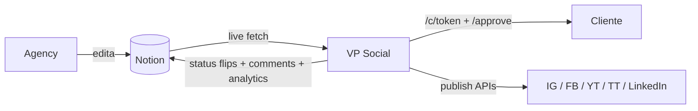

# Arquitetura: Fronteiras Notion ↔ VP Social

> **Antes de implementar uma feature, consulte este doc.** Ele responde "onde isso deveria viver?" — Notion (backstage da agência) ou VP Social (palco do cliente + execução).

## TL;DR

A agency vive no Notion. O cliente **nunca** abre o Notion — UX complexa, paid seats por pessoa, e mistura de privacidade entre clientes. O VP Social existe pra dar ao cliente uma interface dedicada (`/c/[token]` calendar + `/approve/[token]` aprovação) e pra executar tudo que o Notion não faz (publish nas redes, OAuth, workflow stateful, audit imutável).

**Princípio diretor:** Notion = backstage da agency. VP Social = palco do cliente + executor.

Quase nada é literalmente duplicado: o VP faz live-fetch do Notion sempre que precisa mostrar caption/mídia/agenda. O que vive no DB do VP são coisas que o Notion não modela (tokens OAuth, aprovações stateful, audit de execução, identidade multi-tenant) ou que precisam persistir mesmo se o Notion for alterado depois.

## Princípios

1. **Notion é backstage; VP é palco do cliente.** Toda interface client-facing fica no VP. Agency continua no Notion.
2. **Conteúdo editorial → Notion sempre, live-fetch.** Caption, mídia, agenda, briefing — única fonte é o Notion. Zero cache desses campos no DB.
3. **Workflow + execução + identidade → VP.** Aprovações, OAuth tokens, logs de publish, RBAC multi-tenant, comentários estruturados — só o VP.
4. **Cliente nunca abre Notion.** Se uma feature exigiria que o cliente entrasse no Notion, ela está mal arquitetada. Traga pro `/c/[token]`.

## Mapa de domínios

| Domínio | Onde mora | Justificativa |
|---|---|---|
| Briefing do cliente (objetivos, brand voice, persona) | Notion | Editorial colaborativo, agency edita junto |
| Texto da legenda (caption) | Notion | Editing + Notion AI, drafts |
| Mídia (imagens, vídeos, thumb) | Notion | Storage natural, agency faz upload |
| Agenda (data + hora) | Notion | Planejamento editorial |
| Targets (IG Feed / Reel / FB / YT / TT / LinkedIn) | Notion | Decisão editorial |
| Status editorial (rascunho → aprovado → publicado → erro) | Notion | Source of truth pro cron |
| Comentários cliente ↔ agency | Notion (comments sidebar) | Agency vê nativamente, sem duplicação |
| Conta a postar (matching "@conta") | Notion | Editorial decision |
| Mapeamento de fields Notion → VP | DB (`fieldMapping`) | Config, varia por workspace |
| Identidade da agency + clientes | DB (`user`, `client`, `clientMember`, `clientInvite`) | Auth, RBAC multi-tenant |
| Tokens OAuth (Notion, IG, FB, YT, TT, LinkedIn) | DB (`notionConnection`, `instagramAccount`) | Segurança |
| Config WhatsApp Cloud (token, phoneNumberId, template) | DB (`userWhatsappConfig`) | Credenciais |
| Histórico de publicações (per-platform success/fail/skipped) | DB (`publishLog`) | Audit imutável + métricas; persiste após Notion mudar |
| Approval workflow (tokens, decisões, expiry, tacit) | DB (`approvalLink`) | Stateful, Notion não modela; cliente decide via `/approve` |
| Approvers / cadeia multi-step | DB (`approver`, `productionApprover`) | Workflow específico |
| Productions (vídeos long-form, roteiros TipTap) | DB (`production`, `productionComment`) | Editor próprio, não-Notion |
| Audit de execução (logs de aprovação, erros do Notion) | DB (`publishLog` com `platform='aprovação'`) | Surface em `/history` |
| Public calendar token (`/c/{token}`) | DB (`client.publicCalendarToken`) | Segurança, link permanente |
| Health dashboard (status integrações) | Derivado de DB + APIs live | Observabilidade |
| Analytics agregadas (relatórios, charts, melhor horário) | Derivado de `publishLog` | Computado on-demand |

## Fluxo de dados

## Pontos de gravação Notion → VP

O VP escreve no Notion **apenas** nesses pontos, pra agency ver tudo no mesmo lugar:

1. **`markPublished`** / **`markFailed`** (`lib/notion.ts`) — após cron de publish, flipa status pra "Publicado" ou "Erro". *Mandatório:* sem isso o cron republica infinitamente.
2. **`markApproved`** / **`markRevision`** (`lib/notion.ts`) — quando cliente decide em `/approve`, flipa status pra "Aprovado" ou "Em Revisão". *Mandatório:* agency precisa saber da decisão.
3. **`setPostUrls`** (`lib/notion.ts`) — após publish, escreve permalinks no campo rich_text. *Útil:* agency clica e abre o post real.
4. **`addClientComment`** + **`postSystemComment`** (`lib/notion.ts`) — comments no sidebar. *Mandatório:* agency vê + responde dentro do Notion.
5. **`updateAnalytics`** (`lib/notion.ts`) — a cada 6h escreve likes/reach/saved/impressions em campos Number. *Cinza — auditar (ver "Decisões pendentes").*

Tudo o resto (caption, mídia, agenda, status pré-publish) o Notion edita sozinho. VP só lê.

## Anti-padrões — NÃO fazer

- ❌ Espelhar caption/mídia/agenda no DB pra "cachear". O custo de drift > o ganho de latência.
- ❌ Criar UI no VP que duplica funcionalidade editorial do Notion (editor de caption, upload de mídia direto pelo VP). Cliente não precisa, agency já tem no Notion.
- ❌ Convidar cliente como guest no workspace Notion. Decisão tomada: cliente nunca abre Notion.
- ❌ Construir features paralelas em ambos sistemas. Cada feature tem UM dono claro (Notion OU VP).
- ❌ Trazer Notion AI / Notion Workers / Database Sync sem ROI claro contra essa fronteira.

## Padrões aprovados — continuar fazendo

- ✅ `/c/[token]` e `/approve/[token]` fazem live-fetch do Notion via `getPostsByStatus` / `getPostById` / `listComments`. Zero cache de conteúdo no DB.
- ✅ Cron `publishScheduled` é o único produtor de eventos "publicado" — flipa Notion + grava `publishLog`. Toda outra lógica depende dessa cadeia.
- ✅ Cron `tacitApprovalSweep` é o único responsável por aprovações tácitas — atomic `UPDATE ... WHERE` evita race com cliente.
- ✅ `decideApprovalLink` centraliza side-effects (Notion flip + email + chain advance). Toda decisão passa por lá.
- ✅ `lib/integration-health.ts` consolida validators OAuth — reutilizado por `/api/settings/test-config` e `/api/health`.
- ✅ Comments fluem 100% pelo Notion: cliente escreve via `/approve` → `addClientComment` → agency vê no sidebar nativo.
- ✅ Denormalização de `postTitle` + `conta` em `publishLog` e `approvalLink` é audit imutável — não é duplicação ruim. Se o Notion editar/deletar o post, o log preserva o que aconteceu.

## Decisões pendentes

### Analytics write em campos Number do Notion (`updateAnalytics`)

Suspeita: ninguém na agency abre o Notion pra ver número de likes — todos olham no `/history` do VP. Se confirmado, descontinuar o write: `updateAnalytics` para de chamar `lib/notion.ts:updateAnalytics`, métricas ficam só em `publishLog.metrics*`, e os campos Number saem do `fieldMapping`.

**Ação:** perguntar à agency diretamente antes de remover. Sem deadline.

### `setSocialVpUrl` (URL de volta pro VP)

Escreve `https://posts.vp.../scheduled?postId=X` num campo URL no Notion. Útil pra agency clicar e abrir o post no VP, mas redundante se agency sempre flui Notion → VP via dashboard. Manter por enquanto (baixa frequência de write), reavaliar quando aparecer demanda.

## Referência

- `CLAUDE.md` (raiz) — guia operacional pro Claude Code (data flow, multi-tenant boundary, commands).
- `webapp/DEPLOY.md` — Vercel + Neon + Trigger.dev end-to-end.
- `webapp/lib/active-client.ts` — contrato de acesso multi-tenant (`__all__` sentinel, `listAccessibleClients`).
- `webapp/lib/notion.ts` — todas as funções de leitura/escrita Notion.
- `webapp/trigger/publish.ts` — loop de publish (status flips + writeback).
